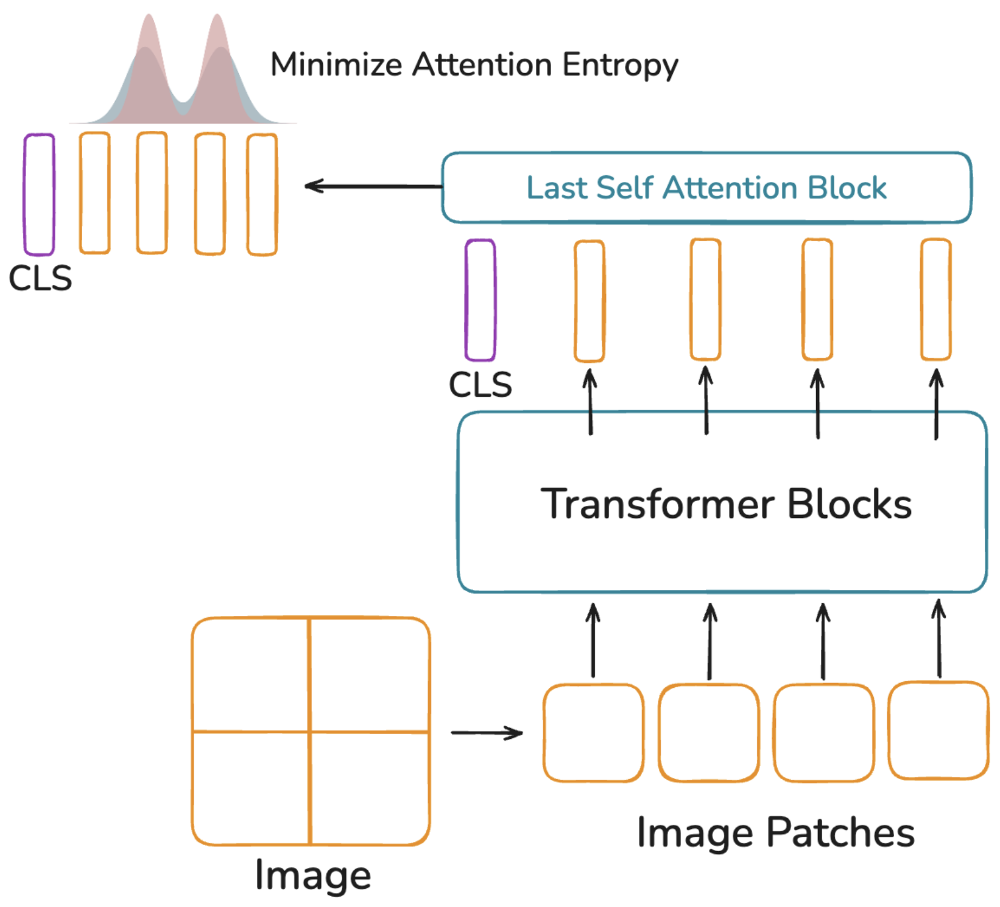
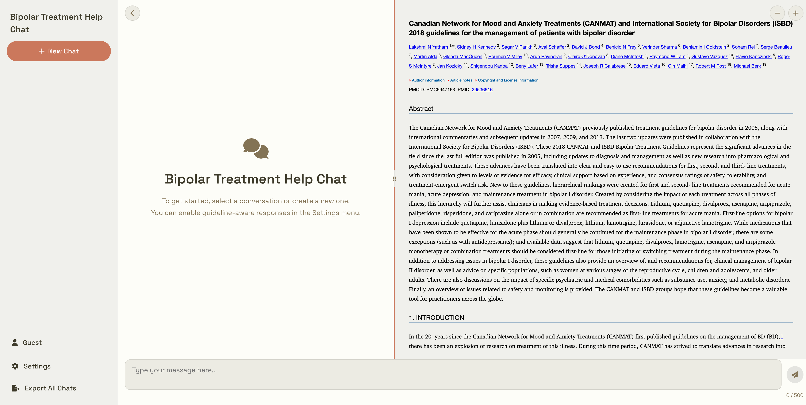
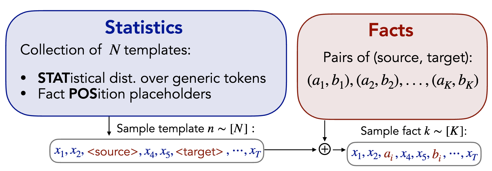

::: {.columns}
::: {.column-main}
👋 I am an undergraduate student at the University of British Columbia. I am broadly interested in understanding what models learn and studying their robustness under distribution shift. I am also interested in the applications of AI in science and society.

- Advised by [Dr. Christos Thrampoulidis](https://sites.google.com/view/cthrampo/home).  
- Collaborators: 
  - [Dr. Evan Shelhammer](https://imaginarynumber.net/research/) on domain adaptation.
  - [Dr. Jolene Reid](https://www.thereidlab.com/jolenereid), [Dr. John Jose Nunez](https://nunez-comp-mental-health-cancer-care.github.io/), and [Dr. John Frostad](https://chbe.ubc.ca/john-m-frostad/) on AI for science.
  - [Dr. Laura Nelson](https://sociology.ubc.ca/profile/laura-nelson/), [Dr. Jonathan Graves](https://economics.ubc.ca/profile/jonathan-graves/), and [Dr. Julia Harten](https://scarp.ubc.ca/directory/julia-harten/) on social and educational applications of AI.

**Email:** [ymali@student.ubc.ca](mailto:ymali@student.ubc.ca) /
[Google Scholar](https://scholar.google.com/citations?hl=en&user=NOvveC4AAAAJ) /
[LinkedIn](https://www.linkedin.com/in/yash-mali-ubc) /
[GitHub](https://github.com/yashm8) /
[CV](cv/YashMaliCV_3p.pdf) /
[arXiv](http://arxiv.org/a/mali_y_1)
:::

::: {.column-side}
{width="100%"}
:::
:::

#### **Selected Research**

::: {.columns}
::: {.column width="25%"}
{width="100%"}
:::

::: {.column width="75%"}
**LookSharp: Attention Entropy Minimization for Test-Time Adaptation**: *ICLR Workshops TTU & CAO 2026*

**Yash Mali**, Evan Shelhamer

We minimize the entropy of CLS-to-patch attention in the final layer as a novel test-time loss, encouraging the model to maintain focused attention on shifted data. [Paper](https://arxiv.org/abs/2511.18925) / [Code](https://github.com/YashM8/looksharp)
:::
:::

---

::: {.columns}
::: {.column width="25%"}
{width="100%"}
:::

::: {.column width="75%"}
**A Chatbot for the Management of Bipolar Disorder**

**Yash Mali**, Zejiao Zeng, Kayoung Heo, Grace Zhang, Jincheng Chen, Kamyar Keramatian, Gayatri Saraf, Marco Solmi, Edwin Tam, Sagar V. Parikh, Ayal Schaffer, Serge Beaulieu, Raymond Ng, Lakshmi N. Yatham, John-Jose Nunez

Agentic LLM system for doctors that provides fast and accurate medical recommendations with reference from reliable sources (Co-op, May 25 - Aug 25). [Paper](https://www.medrxiv.org/content/10.64898/2025.11.30.25341311v2) 

:::
:::

---

::: {.columns}
::: {.column width="25%"}
{width="100%"}
:::

::: {.column width="75%"}
**prAxIs UBC: Developing AI education modules in Faculty of Arts Courses**: *Conference on Teaching and Research in Economic Education Workshop, 2026* 

Jonathan Graves, Laura Nelson, and prAxIs Contributors (including **Yash Mali**)

AI education in the Faculty of Arts. Building modules that teach students how to use AI to solve real problems in the arts. [Website](https://ubcecon.github.io/praxis-ubc/) 
:::
:::

---

::: {.columns}
::: {.column width="25%"}
{width=100%}
:::

::: {.column width="75%"}
**A particle cohort study (ParCS) of the impact of glucose and sucrose solutions on the kinetics of starch gelatinization**: *Food Hydrocolloids, 2026*

Lily Santos O' Keefe, **Yash Mali**, John Frostad

Contributed particle tracking software for tracking starch particles to study the kinetics of starch gelatinization (Co-op, May 24 - Aug 24). [Paper](https://www.google.com/search?q=A+particle+cohort+study+(ParCS)+of+the+impact+of+glucose+and+sucrose+solutions+on+the+kinetics+of+starch+gelatinization&rlz=1C5OZZY_enCA1156CA1156&oq=A+particle+cohort+study+(ParCS)+of+the+impact+of+glucose+and+sucrose+solutions+on+the+kinetics+of+starch+gelatinization) / [Code](https://github.com/YashM8/Track)
:::
:::

#### **Other Research**

---

::: {.columns}
::: {.column width="25%"}
{width="100%"}
:::

::: {.column width="75%"}
**Undergraduate Thesis**

**Yash Mali**, Tina Behnia, Christos Thrampoulidis

Investigated how noise and diversity in the training data affect the internal representations and factual recall of autoregressive language models. 
:::
:::

#### **Other Highlights**

- Research Awards: [3X Undergraduate Research Award: WLIURA](https://students.ubc.ca/career/work-learn-international-undergraduate-research-awards/), [Advanced Machine Learning Network: AML-TN](https://amltn.cs.ubc.ca/people/undergraduate-research-awards)
- Invited Talk: [BC Cancer Summit 2025](https://bccancersummit.ca/): "AI for Cancer Care"
- President of the [UBC AI Club](https://ubcaiclub.github.io/) (2025-2026)
- ML Lead at [UBC Uncrewed Aircraft Systems](https://ubcuas.com/) (Sep 24 - )
- AI and Automation Developer at [Lux Bio](https://www.luxbio.ca/technology) (co-op, Sep 24 – May 25): Applied AI drug discovery and automation for bioprocess engineering.
- Instrumentation member at [UBC Biological Internet of Things](https://ubcbiot.com/) (May 25 - )
